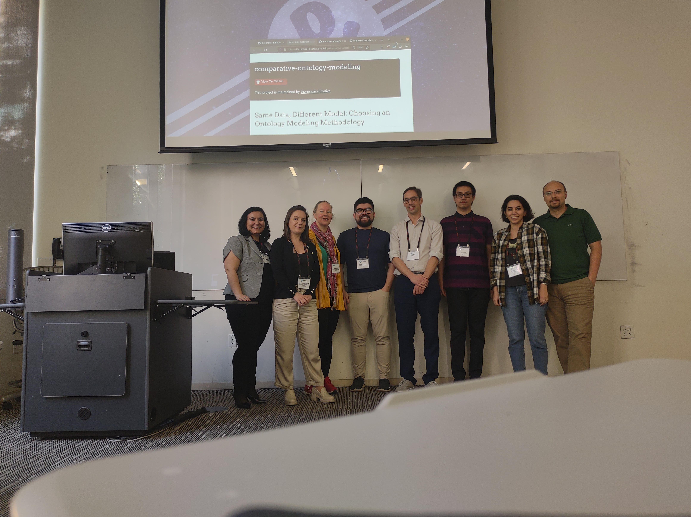

# Same Data; Different Models (2023)
co-located with the Web Conference 2023, University of Texas, Austin, TX, USA

## Details
Three tutorials were given:
* [Domain Reference Ontology Design](../sessions/drod) -- [Torsten Hahmann](https://github.com/thahmann)
* [KNowledge Acquisition and Representation Methodology](../sessions/knarm) -- [Hande McGinty](https://github.com/handemcginty)
* [Modular Ontology Modeling](../sessions/momo) -- [Cogan Shimizu](https://github.com/cogan-shimizu/)

## Attendees

We had a total of 13 participants over the course of the tutorial. 

## Retrospective
placeholder
